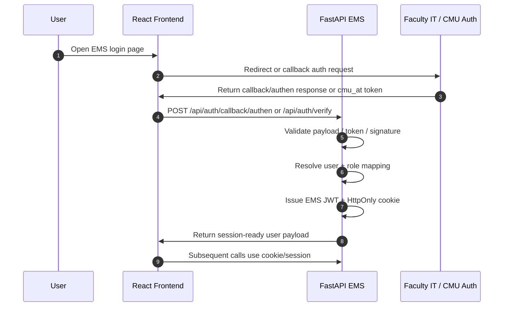

# Auth Integration Strategy
## EMS Academic Operations Platform

**Purpose:** Define how EMS should integrate with the faculty IT authentication pattern without rewriting the platform into Laravel/PHP.

**Context:**
- Current EMS stack: React 18 + TypeScript + Vite frontend, FastAPI + SQLAlchemy backend, JWT/HttpOnly-cookie session auth
- Faculty IT pattern: Laravel-style `AuthMiddleware` + `AuthenController` + `callback/authen` flow + `cmu_at` token or callback payload
- Goal: keep EMS business logic and backend architecture stable while integrating with faculty authentication standards

---

## 1. Current EMS Authentication State

### Backend files reviewed
- [backend/auth_utils.py](../../backend/auth_utils.py)
- [backend/permissions.py](../../backend/permissions.py)
- [backend/routers/auth.py](../../backend/routers/auth.py)
- [frontend/src/store/auth.store.tsx](../../frontend/src/store/auth.store.tsx)
- [frontend/src/services/auth.service.ts](../../frontend/src/services/auth.service.ts)

### What EMS already does well
- Issues JWTs with `HS256`
- Stores the session in an HttpOnly cookie (`ems_session`)
- Supports legacy Bearer token clients in parallel
- Keeps active role / effective role separate from the base user account
- Supports admin impersonation via `view_as_role`
- Records login/logout and view-as changes through audit logging

### Where EMS diverges from the faculty IT pattern
- No dedicated callback/authen endpoint for external identity providers
- No explicit CMU token verification stage
- No middleware/controller split for auth entry flow
- No auth integration layer that cleanly separates external identity proof from EMS session issuance
- Role resolution is duplicated across backend helpers and frontend pages

---

## 2. Duplicated Auth / Role Logic

### Backend duplication
- `auth_utils.py` and `permissions.py` both define role predicates and role-aware helpers
- `get_effective_role()` exists in both files with the same intent
- `require_admin`, `require_staff_or_admin`, and `require_view_all` are implemented in parallel across both modules
- `auth_utils.py` still contains legacy authorization helpers that overlap with `permissions.py`

### Frontend duplication
- The same fallback chain appears in multiple pages:
  - `user?.effective_role ?? user?.active_role ?? user?.role ?? null`
- Role access checks are repeated in page components instead of using a semantic permission abstraction
- `frontend/src/utils/roles.ts` already contains canonical helpers, but some pages bypass them

### Structural impact
- DRY violations make auth behavior easy to drift
- Any future CMU or faculty auth change will require edits in too many places
- Current design is workable for EMS, but it needs a clean integration boundary before adding external auth providers

---

## 3. Recommended Auth Integration Layer

Introduce an explicit integration boundary between external faculty identity and EMS session management.

### Proposed layer responsibilities
1. Accept external auth callback or token verification request
2. Validate CMU/faculty identity proof
3. Normalize external identity into a stable EMS login payload
4. Resolve or create the EMS user record
5. Issue EMS JWT / HttpOnly session cookie
6. Preserve auditability for login, callback source, and identity binding

### Suggested backend shape
- `backend/routers/auth_integration.py` or extension of `backend/routers/auth.py`
- `backend/services/auth_integration_service.py`
- `backend/services/cmu_identity_service.py`
- `backend/services/session_service.py`
- Keep `auth_utils.py` focused on session/JWT mechanics and user resolution
- Keep `permissions.py` focused on authorization decisions only

### Suggested external identity contract
Accept one of these forms from faculty IT:
- `cmu_at` bearer token
- callback payload from `callback/authen`
- signed assertion or code exchange payload, if provided by IT

### Internal EMS session contract
After verification, EMS should issue:
- JWT with `sub`, `active_role`, and optional source metadata
- HttpOnly cookie for browser sessions
- audit event for auth source, login channel, and role resolution outcome

---

## 4. Integration Options

### Option A: FastAPI implements `callback/authen` directly

**Flow:**
1. Faculty IT redirects or posts to EMS `/api/auth/callback/authen`
2. EMS verifies `cmu_at` or callback payload
3. EMS resolves the user and role mapping
4. EMS issues its own JWT and cookie
5. EMS frontend continues using the current auth store and auth service

**Benefits**
- Lowest architecture disruption
- No new runtime or gateway to maintain
- Keeps EMS session ownership inside EMS
- Easier audit logging because identity proof and session issuance live in one stack
- Less migration risk for current React/FastAPI deployment

**Costs / constraints**
- EMS must implement the external verification logic carefully
- The backend needs a clear integration service so callback handling does not leak into route handlers
- If faculty IT changes its callback protocol, EMS must update the integration adapter

**Best when**
- EMS remains the primary application owner
- Faculty IT exposes a stable callback/token verification contract
- The team wants the smallest safe change set

---

### Option B: Laravel acts as Auth Gateway

**Flow:**
1. Faculty IT authenticates in Laravel gateway
2. Laravel validates `cmu_at` / callback payload
3. Laravel forwards a verified identity assertion to EMS
4. EMS trusts the gateway assertion and issues its own session

**Benefits**
- Closer to the faculty IT pattern if their internal standard is already Laravel-centric
- Can hide faculty auth complexity from EMS
- May be easier if IT already maintains a shared auth gateway for multiple systems

**Costs / constraints**
- Introduces an extra service and trust boundary
- Requires gateway lifecycle, deployment, and incident ownership
- Adds another place where audit and PDPA responsibilities must be split
- More moving parts for session handoff and token propagation
- Higher operational complexity than direct integration

**Best when**
- Faculty IT already mandates a reusable gateway for many systems
- EMS must consume an existing centralized authentication service rather than call faculty IT directly
- The institution wants one auth broker for multiple applications

---

## 5. Comparison Matrix

| Dimension | Option A: FastAPI Direct Callback | Option B: Laravel Auth Gateway |
|-----------|-----------------------------------|---------------------------------|
| Security | Strong if verification is centralized in EMS and callback is signed/validated | Strong, but depends on gateway trust and extra service hardening |
| Maintainability | Higher for EMS team; fewer moving parts | Lower; more services and more deployment coordination |
| IT Compatibility | Good if faculty IT can provide callback/token contract | Excellent if Laravel is the formal institutional standard |
| Migration Effort | Lower | Higher |
| PDPA / Audit Impact | Simpler audit trail; fewer handoffs | More audit complexity across gateway and EMS |
| Long-term Scalability | Good for EMS-first growth | Good only if the gateway becomes a shared enterprise platform |

---

## 6. Recommendation

### Recommended architecture: Option A with a dedicated integration layer

The safest approach is for EMS to keep its current FastAPI backend and add a dedicated auth integration layer that directly accepts faculty callback/authen payloads or `cmu_at` verification results.

**Why this is the safest choice**
- Preserves the current EMS session model
- Avoids a full Laravel rewrite
- Avoids introducing a second production runtime unless absolutely necessary
- Keeps auth logic explicit and auditable inside EMS
- Lets EMS remain the owner of business authorization decisions

### Is a Laravel rewrite necessary?
**No.**
A Laravel rewrite is not necessary to align with faculty IT authentication standards. EMS only needs to implement the faculty-facing callback contract and identity verification adapter, not replace the backend stack.

Laravel only becomes necessary if the institution already has a mandatory centralized Laravel auth gateway that all systems must consume. That is an infrastructure policy decision, not an architectural requirement for EMS itself.

---

## 7. Proposed Runtime Flow

---

## 8. Files Likely Affected

### Backend
- [backend/routers/auth.py](../../backend/routers/auth.py)
- [backend/auth_utils.py](../../backend/auth_utils.py)
- [backend/permissions.py](../../backend/permissions.py)
- New auth integration service module(s)
- Potential configuration in backend settings once Phase 2 starts

### Frontend
- [frontend/src/services/auth.service.ts](../../frontend/src/services/auth.service.ts)
- [frontend/src/store/auth.store.tsx](../../frontend/src/store/auth.store.tsx)
- Login / role-selection pages if the callback flow changes

### Documentation
- [docs/architecture/AUTH_INTEGRATION_STRATEGY.md](AUTH_INTEGRATION_STRATEGY.md)
- [docs/architecture/AUTH_DRY_REFACTOR_PLAN.md](AUTH_DRY_REFACTOR_PLAN.md)

---

## 9. Next Implementation Step

1. Define the external callback contract with faculty IT: token format, signature, expiry, and error handling
2. Add an EMS auth integration service that can verify the callback payload independently from session issuance
3. Consolidate backend role helpers so `permissions.py` becomes the single authorization source of truth
4. Update the frontend to consume the same auth service regardless of whether login comes from direct EMS login or faculty callback auth
5. Add audit events for auth callback received, verified, accepted, rejected, and session issued

---

## 10. Summary

EMS should not be rewritten into Laravel/PHP. The correct direction is a stable FastAPI-based integration layer that speaks the faculty auth contract, verifies `cmu_at` or callback payloads, and then issues EMS-native sessions and roles.

This preserves the current business logic, reduces migration risk, and keeps the platform on the academic-operations path without changing the underlying stack.