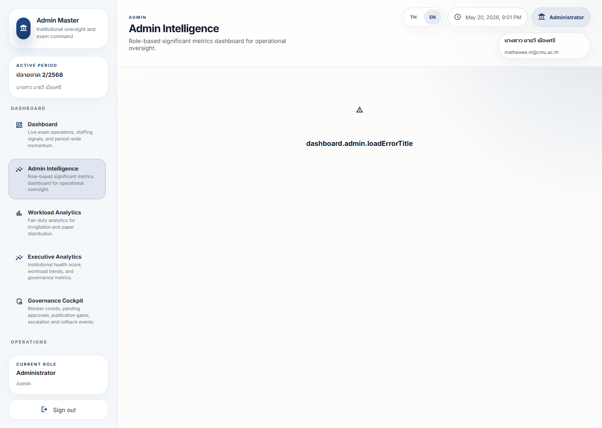

# Admin Intelligence Dashboard Guide

## Purpose

Admin Intelligence is the role-specific dashboard for significant operational metrics that should not be buried inside the general landing page.

It is where an admin should look when broad dashboard signals need a more governance-aware or workload-aware interpretation.

## Live Screenshot

Full page:
[admin-intelligence-dashboard-full.png](../screenshot-atlas/images/admin/admin-intelligence-dashboard-full.png)

## Current Capture Note

The local screenshot pass reached the route successfully, but the page rendered a load-error state instead of its intended metric cards.

Visible issue:
`dashboard.admin.loadErrorTitle`

This means the screenshot is documentation of the current runtime problem as well as the page location.

## What To Look At First

- Whether the page loaded real metrics or an error state
- Which metric group failed
- Whether the failure is localized or platform-wide
- Whether the main dashboard still has enough signal to operate safely

## Reading Order

1. Confirm the page title and route shell loaded.
2. Check whether the primary intelligence cards rendered or failed.
3. If the page failed, cross-check the main dashboard and operational health before making decisions from stale assumptions.
4. Open the screenshot capture report if the runtime issue needs documentation or follow-up.

## What Action Should I Take?

- If the page loads normally, use it to review significant metrics before escalating broader operational concerns.
- If the page shows the captured error state, treat it as a platform-health issue and fall back to `Dashboard`, `Operational Health`, and `Workload Analytics`.
- Escalate if the missing intelligence page blocks publication or oversight decisions.
