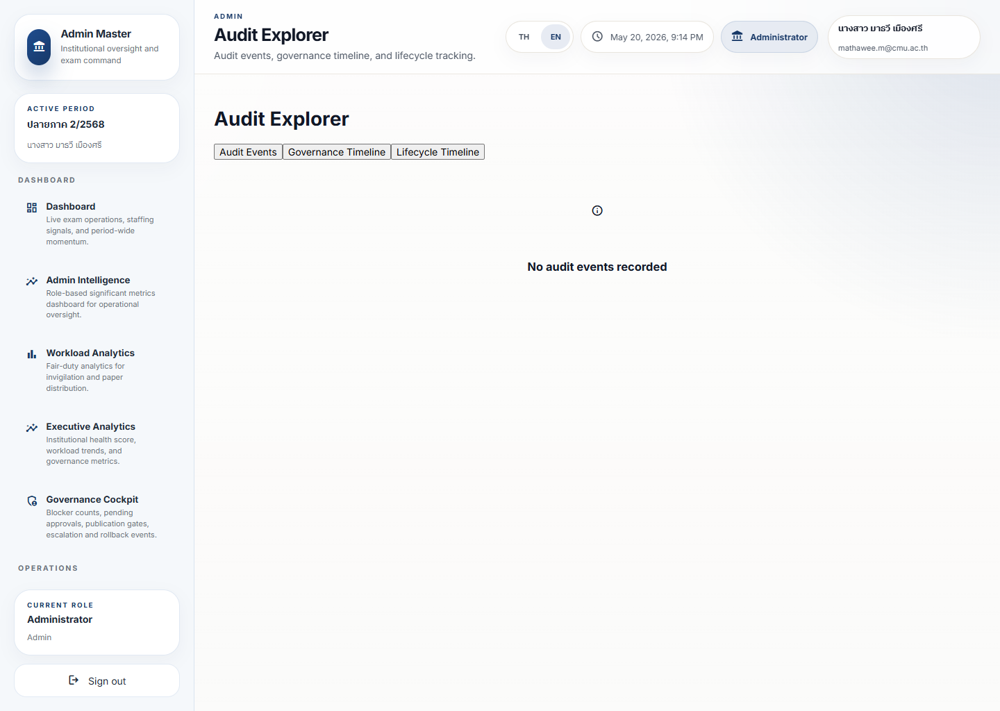

# Audit Explorer Guide

## Purpose

Audit Explorer helps users see what happened, when it happened, and whether the workflow path matches policy.

It is the place to go when a decision needs evidence.

## Live Screenshot

Full page:
[audit-explorer-full.png](../screenshot-atlas/images/governance/audit-explorer-full.png)

## Current Capture Note

The route loaded successfully and displayed a valid empty-state result: `No audit events recorded`.

That is useful because it shows the difference between a working trace explorer with no records and a broken route.

## What Matters Most

- Who did what
- When it happened
- Which workflow path was taken
- Whether the event was expected
- Whether any step is missing or unusual

## Dashboard Reading Order

1. Choose the correct tab: audit events, governance timeline, or lifecycle timeline.
2. Check whether the page is empty or whether it contains a usable trace.
3. Open the event sequence only after confirming the record belongs to the right workflow.
4. Escalate if the timeline cannot explain a real decision.

## Metric Interpretation

- A complete trace means the record is easier to trust
- A missing step means the workflow may be incomplete
- A mismatch between action and policy means review is needed
- A repeated audit pattern may reveal a process problem

## Urgency Levels

- Green: trace is complete and consistent
- Amber: trace needs review
- Red: trace or policy issue requires escalation

## Warning Interpretation

- A warning can mean the record is incomplete
- A warning can mean someone used the wrong path
- A warning can mean a policy exception occurred

## Operational Meaning

Audit Explorer answers: can we explain this later?

## Governance Meaning

If the trace is weak, the institution may not be able to justify a release, approval, or exception.

## Recommended Actions

1. Open the relevant event or workflow.
2. Compare the trace against the expected path.
3. Look for missing ownership, time, or approval details.
4. Escalate if the record cannot be explained confidently.

## What Action Should I Take?

- Use the explorer to confirm evidence, not just to browse logs.
- Treat an empty explorer differently from an error state.
- Open governance review if the audit trail is missing for a publication-sensitive action.

## Escalation Triggers

- Missing audit trail
- Policy mismatch
- Unclear ownership
- Unexpected manual intervention

## Common Misunderstandings

- An audit record is not just a log; it is proof of the path taken.
- A complete record is not automatically correct, but it is easier to trust.
- A policy exception must be understood, not just recorded.

## Simplified Explanation

Use this dashboard when you need to prove how the system got from one step to the next.
