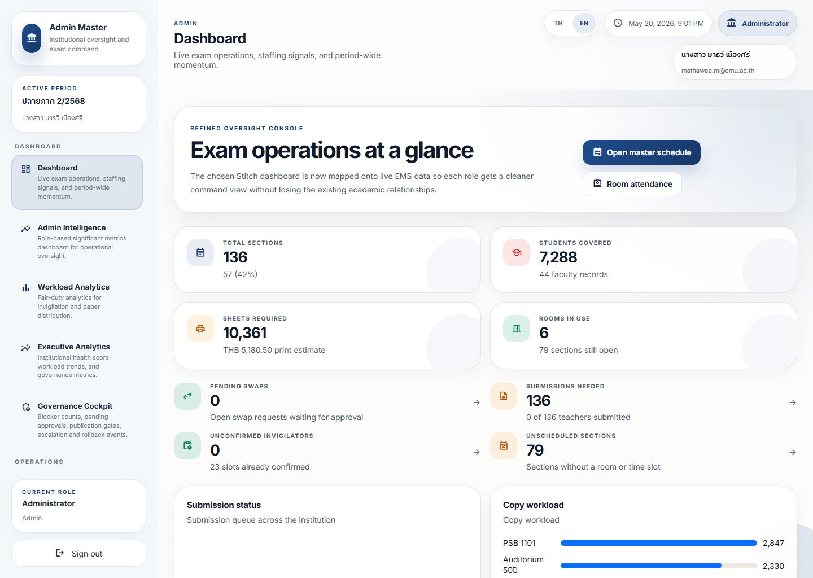

# Dashboard Guide

## What This Is For

This is the main operational landing page.

It should help a user answer one question quickly: what needs attention now?

## Live Screenshot

Full page:
[admin-dashboard-overview-full.png](../screenshot-atlas/images/admin/admin-dashboard-overview-full.png)

Role variants:
[staff-dashboard-overview-viewport.png](../screenshot-atlas/images/staff/staff-dashboard-overview-viewport.png) · [teacher-dashboard-overview-viewport.png](../screenshot-atlas/images/teacher/teacher-dashboard-overview-viewport.png)

## What To Look At First

- Active alerts
- High-risk blockers
- Period readiness
- Workload balance
- Missing operational coverage

## Dashboard Reading Order

1. Read the hero summary and primary action buttons.
2. Scan the top metric cards for the signal that changes the next decision.
3. Check the role-specific highlight list before drilling into specialized pages.
4. Open the related workflow page only after the top signal is clear.

## What The Colors Mean

- Green: normal or acceptable
- Amber: watch closely or prepare action
- Red: act now or escalate

## What Not To Do

- Do not treat the page as a report archive.
- Do not read every card as equally urgent.
- Do not assume the dashboard replaces the underlying workflow page.

## Recommended Action Pattern

1. Identify the most urgent signal.
2. Open the related workflow page.
3. Confirm whether the issue is operational, governance-related, or data-related.
4. Escalate if the signal affects publication, coverage, or active exam operations.

## What Action Should I Take?

- Open `Workload Analytics` if the issue is fairness or staffing pressure.
- Open `Governance Cockpit` if the issue is approval, blocker, or release safety.
- Open `Operational Health` if the signal looks like platform or integration drift.
- Open `My Exam Work` or `Submissions` when the next action belongs to a teacher workflow.
