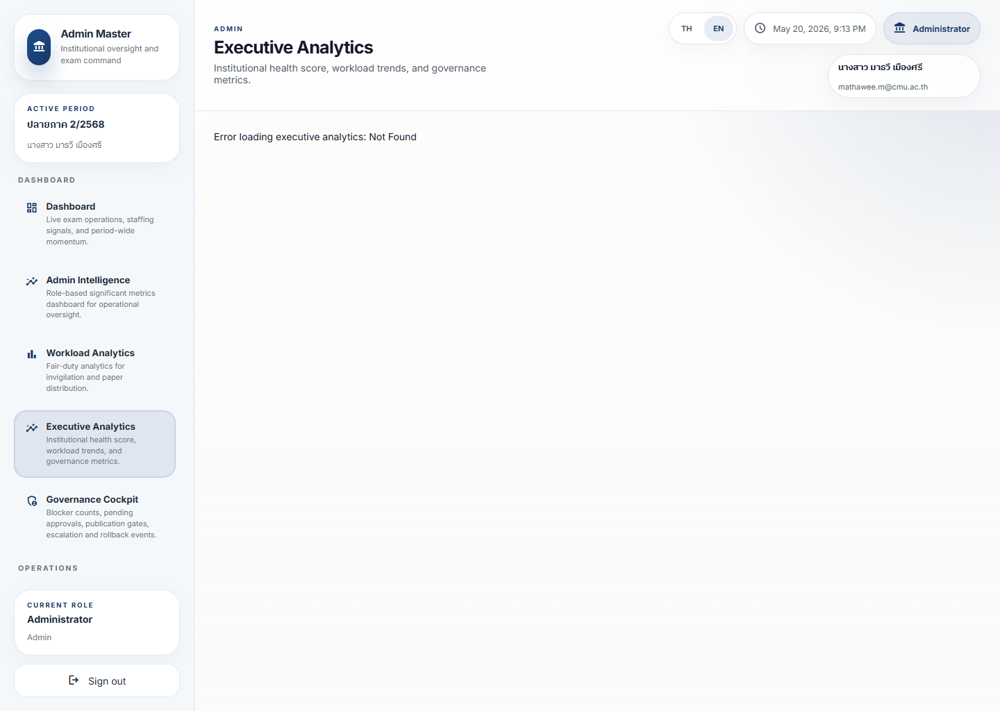

# Executive Analytics Guide

## Purpose

Executive Analytics gives leaders a strategic view of readiness, workload, governance pressure, and institutional direction.

It should support decisions without requiring the leader to inspect every underlying workflow.

## Live Screenshot

Full page:
[executive-analytics-full.png](../screenshot-atlas/images/executive/executive-analytics-full.png)

## Current Capture Note

The route shell was reachable during the screenshot pass, but the local stack rendered `Error loading executive analytics: Not Found`.

Use this guide together with the screenshot capture report. The image is an honest record of the current failure state, not a fully healthy analytics render.

## What Matters Most

- Readiness
- Risk trend
- Workload imbalance
- Governance backlog
- Whether the institution is moving in a stable direction

## Reading Order

1. Confirm whether the analytics board loaded or failed.
2. If it loaded, read the readiness and trend summary before opening detail.
3. If it failed, cross-check `Dashboard`, `Governance Cockpit`, and `Operational Health`.
4. Escalate if leadership decisions depend on the missing analytics layer.

## Metric Interpretation

- Readiness means the institution can continue with confidence
- Risk trend shows whether things are improving or worsening
- Workload imbalance means pressure is not evenly distributed
- Governance backlog means decisions or approvals are slowing progress

## Urgency Levels

- Green: normal leadership monitoring
- Amber: prepare intervention or review
- Red: strategic issue requiring direct attention

## Warning Interpretation

- A warning on its own is not enough; the trend matters
- A repeated warning is more important than a one-time spike
- A governance warning often means the system cannot safely move forward yet

## Operational Meaning

The executive view answers: what is most likely to affect the institution next?

## Governance Meaning

This dashboard helps leaders protect trust, timing, and continuity.

## Recommended Actions

1. Read the top summary first.
2. Identify the one issue that changes the plan.
3. Open the supporting dashboard if detail is needed.
4. Escalate only when the issue affects publication, fairness, or continuity.

## What Action Should I Take?

- Use the executive page for trend confirmation, not for first discovery of operational detail.
- If the route shows the captured error state, treat it as a platform issue and document the workaround path.
- Shift to `Governance Cockpit` when approval or publication safety is the primary concern.

## Escalation Triggers

- Strategic readiness drops
- Workload pressure becomes uneven
- Governance backlog threatens timing
- Operational health degrades across multiple areas

## Common Misunderstandings

- Executive analytics is not a replacement for operational detail.
- A strong score does not mean every local issue is solved.
- A single bad chart should not dominate the decision without context.

## Simplified Explanation

This dashboard tells leaders whether the institution is safe, strained, or in trouble.
