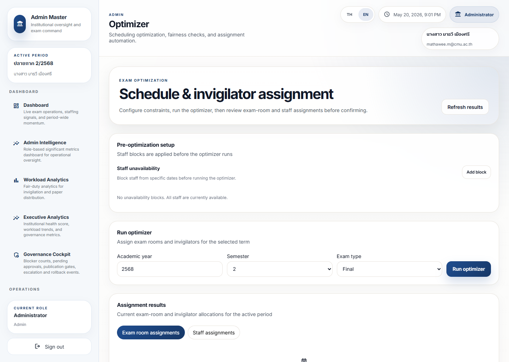

# Optimization Dashboard Guide

## Purpose

The Optimization Dashboard shows how scheduling or assignment optimization is performing and whether the result is safe to use.

It helps users understand whether the system produced a usable plan or a plan that still needs review.

## Live Screenshot

Full page:
[optimization-dashboard-full.png](../screenshot-atlas/images/admin/optimization-dashboard-full.png)

Related trace view:
[optimization-trace-viewport.png](../screenshot-atlas/images/admin/optimization-trace-viewport.png)

## What Matters Most

- Whether key constraints are satisfied
- Whether the schedule is balanced
- Whether important conflicts remain
- Whether the result is ready for publication
- Whether the optimization quality is strong enough to trust

## Dashboard Reading Order

1. Read the pre-optimization setup.
2. Confirm the term and exam-type inputs are correct.
3. Run or refresh the optimizer only after the setup is trustworthy.
4. Check assignment results before opening trace detail.

## Metric Interpretation

- Quality scores usually reflect how complete or feasible the plan is
- Constraint warnings show where the plan may be unsafe or inefficient
- Balance indicators show whether workload or coverage is distributed well
- A lower-quality result often means the plan should not be published yet

## Urgency Levels

- Green: candidate plan is likely ready
- Amber: review the result before publishing
- Red: do not publish without correction or review

## Warning Interpretation

- A constraint warning means the plan may violate a rule
- A coverage warning means a room, staff, or duty requirement may be missing
- A quality warning means the optimization result is not yet dependable

## Operational Meaning

This dashboard answers: is the generated plan good enough to use?

## Governance Meaning

Optimization must be controlled because a bad plan can create downstream operational harm.

## Recommended Actions

1. Review the top quality and constraint signals.
2. Open the trace if the result looks suspicious.
3. Compare the plan with the operational requirements.
4. Escalate if publication would create risk or unfairness.

## What Action Should I Take?

- Use the setup page to verify assumptions before treating the output as useful.
- Open `Optimization Trace` when a result is unclear, weak, or disputed.
- Stop before publication if the quality or coverage signals remain weak.

## Escalation Triggers

- Constraint failure
- Low quality score
- Missing coverage
- Large imbalance
- Conflicting trace evidence

## Common Misunderstandings

- A generated plan is not automatically safe.
- A strong-looking layout can still hide a constraint failure.
- Optimization should support judgment, not replace it.

## Simplified Explanation

This dashboard tells users whether the system’s proposed plan is acceptable or needs more work.
