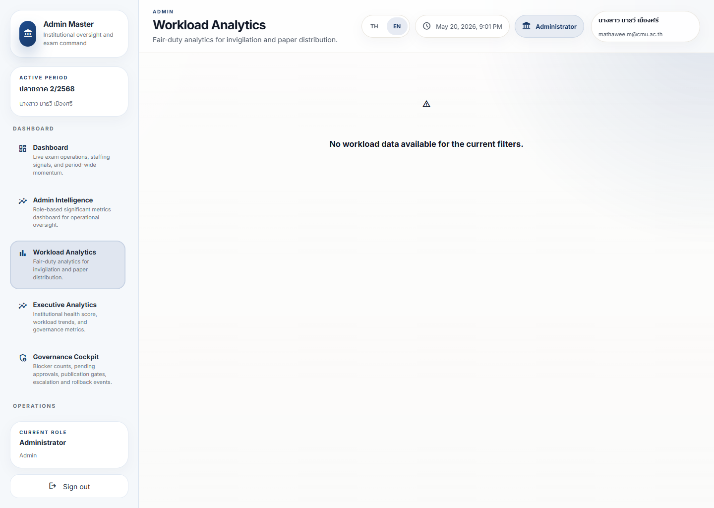

# Workload Duty Analytics Guide

## What This Is For

This dashboard explains how invigilation and paper-distribution duty is spread across people.

It helps users see fairness, imbalance, and workload pressure without reading raw records.

## Live Screenshot

Full page:
[workload-duty-analytics-full.png](../screenshot-atlas/images/admin/workload-duty-analytics-full.png)

Role variants:
[duty-workload-viewport.png](../screenshot-atlas/images/staff/duty-workload-viewport.png) · [my-workload-viewport.png](../screenshot-atlas/images/teacher/my-workload-viewport.png)

## Current Capture Note

The admin and staff captures both rendered a valid no-data state for the active filters.

That is still useful for humanization because it shows readers what the page looks like when the route works but the workload dataset is empty.

## What To Look At First

- Total duty count
- People with unusually high load
- People with unusually low load
- Daily trend of duty accumulation
- Time-slot pressure
- Fairness band or imbalance signal

## Dashboard Reading Order

1. Confirm whether you are in the admin, staff, or teacher workload variant.
2. Read the summary and fairness signal first.
3. Check the people comparison and time pressure next.
4. If the screen is empty, treat it as a filter/data signal before assuming the page is broken.

## What The Colors Mean

- Green: workload is broadly balanced
- Amber: distribution is starting to drift
- Red: imbalance or pressure needs attention

## What It Means In Practice

- High load is not automatically a problem, but it should be reviewed.
- Low load is not automatically a success, but it may indicate underuse or missing assignment.
- A fairness warning means the next assignment cycle should be reviewed before publication.

## Recommended Action Pattern

1. Review the imbalance score.
2. Look at the people table for the largest differences.
3. Check the time-slot view for pressure peaks.
4. Open the operational workflow if a correction is needed.
5. Escalate if the imbalance is likely to affect fairness, readiness, or staffing.

## What Action Should I Take?

- Re-check scope and filters when the empty state is shown.
- Open staffing or scheduling workflows when the imbalance signal is real.
- Escalate only when the fairness problem affects readiness, trust, or repeated overload.
