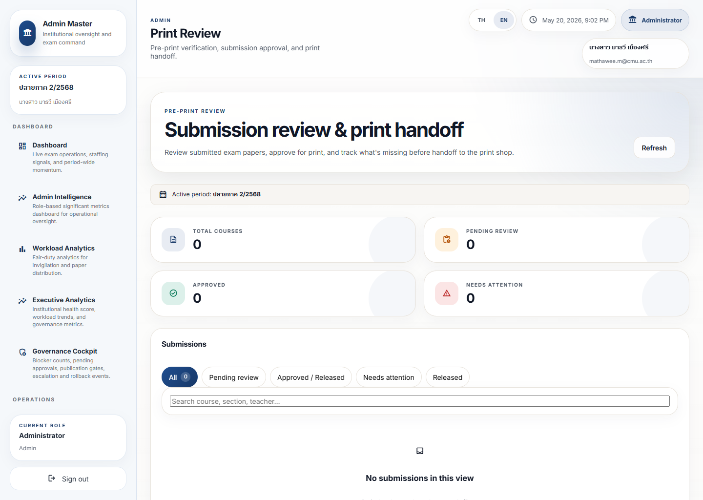
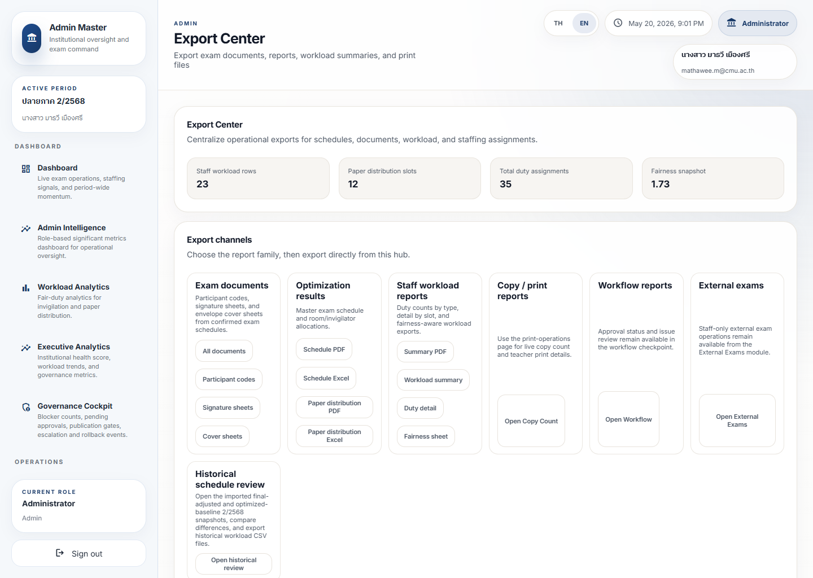
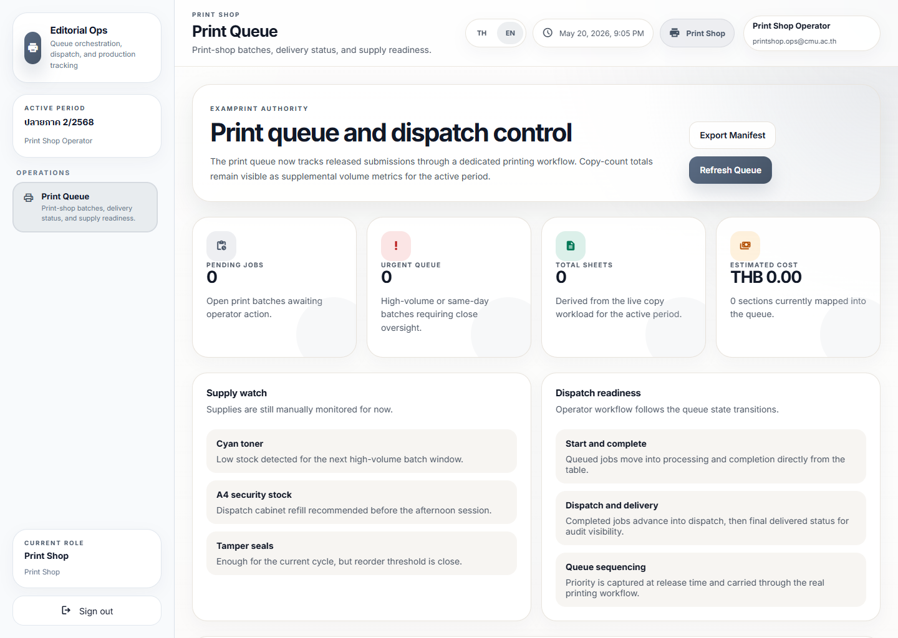

# Distribution Workflow Journey

## Operational Purpose

This journey shows how papers or materials move from preparation to handoff.

## Expected Mindset

The user should think in delivery order and traceability.

## Step-by-Step Flow

1. Open the distribution queue.
2. Confirm the item list.
3. Check the destination and timing.
4. Prepare the handoff.
5. Complete delivery.
6. Confirm the trace entry is recorded.
7. Escalate if an item is missing or delayed.

## Screenshot Sequence

### Screenshot 1: print review

Look here first:
The submission-state counters and the list area that shows what is ready for print handoff.

Common mistake:
Confusing a teacher submission screen with the pre-print approval queue.

What to do next:
Confirm the record is approved or released for printing.

### Screenshot 2: export center

Look here first:
The export families for documents, optimization outputs, and workload reports.

Common mistake:
Expecting the export hub itself to act as the live dispatch queue.

What to do next:
Use the export family that prepares the handoff package, then move to the print-shop queue.

### Screenshot 3: print queue

Look here first:
Pending jobs, urgent queue, and the dispatch-readiness guidance.

Common mistake:
Treating the queue as proof of content approval. Approval happens earlier in `Print Review`.

What to do next:
Dispatch, complete delivery, and confirm the queue state transition is visible.

## Annotation Instructions

- Highlight the delivery owner
- Circle the destination and time
- Label the completion state
- Mark missing-item warnings clearly

## Governance Implications

Distribution must be traceable so the institution can explain what was delivered and when.

## Stress Points

- Handoff delay
- Missing material
- Wrong destination
- Incomplete trace

## Common Errors

- Delivering without confirming the queue
- Skipping trace completion
- Treating a partial delivery as complete

## Recovery Path

- Verify the queue again
- Check the handoff owner
- Escalate if the delay affects an active exam
