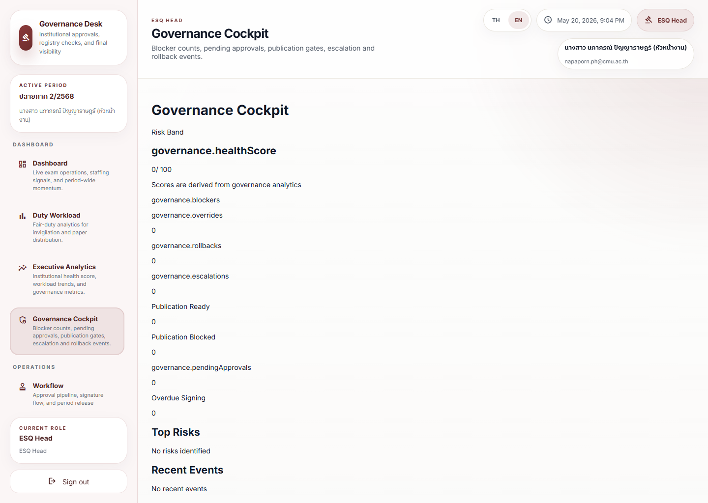

# Executive Monitoring Journey

## Operational Purpose

This journey shows how a leader reviews the institution’s health and decides whether to intervene.

## Expected Mindset

The leader should look for one or two important signals, not every detail.

## Step-by-Step Flow

1. Open the executive dashboard.
2. Review the summary first.
3. Identify the most important risk or trend.
4. Open a supporting dashboard only if detail is needed.
5. Decide whether to monitor, request review, or escalate.
6. Confirm the next action owner.

## Screenshot Sequence

### Screenshot 1: main dashboard

Look here first:
The hero summary and the top metric cards.

Common mistake:
Reading too far down the page before deciding which single signal matters most.

What to do next:
Open the specialized page that matches the risk.

### Screenshot 2: executive analytics

Look here first:
The current error state shown in the local runtime.

Common mistake:
Assuming route access means analytics readiness.

What to do next:
If the page is in error, fall back to `Governance Cockpit` and `Operational Health`.

### Screenshot 3: governance cockpit

Look here first:
The blocker and governance summary area.

Common mistake:
Escalating from a trend page before confirming whether the issue is really a governance blocker.

What to do next:
Use governance signals to decide whether to monitor, intervene, or block release.

## Annotation Instructions

- Circle the top summary signal
- Highlight the risk trend
- Label the next action area
- Mark escalation or follow-up owner

## Governance Implications

Executive monitoring should create clear direction without bypassing the governance chain.

## Stress Points

- Conflicting dashboard signals
- High-level pressure with little detail
- Time-sensitive escalation

## Common Errors

- Reading too much detail too early
- Ignoring trend direction
- Skipping confirmation of the action owner

## Recovery Path

- Open the supporting dashboard
- Confirm the scope and period
- Escalate if the signal affects readiness or continuity
