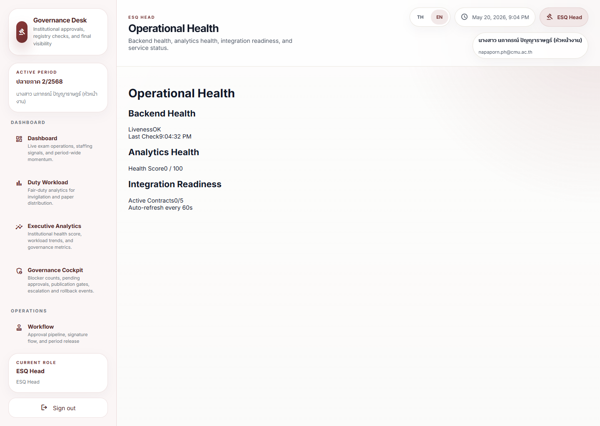

# Operational Health Review Journey

## Operational Purpose

This journey shows how a user checks whether the operation is stable enough to continue.

## Expected Mindset

The user should be alert and calm, looking for signals that the operation may drift.

## Step-by-Step Flow

1. Open the operational health dashboard.
2. Check the top stability signal.
3. Review any repeated warnings.
4. Open the related workflow or page if needed.
5. Decide whether to continue, monitor, or escalate.
6. Record the outcome if the issue needs follow-up.

## Screenshot Sequence

### Screenshot 1: operational health

Look here first:
Backend Health, Analytics Health, and Integration Readiness.

Common mistake:
Reading one score in isolation instead of checking whether several health areas are weak together.

What to do next:
Open the affected supporting page if one subsystem looks unhealthy.

### Screenshot 2: governance cockpit

Look here first:
Whether the operational-health concern has already turned into a blocker or pending-approval issue.

Common mistake:
Escalating a technical wobble as a governance failure before confirming its impact on release safety.

What to do next:
Decide whether to continue, monitor, or hold work based on both health and governance state.

## Annotation Instructions

- Highlight the top stability signal
- Circle repeated warnings
- Label the action recommendation
- Mark escalation triggers clearly

## Governance Implications

Operational stability is part of governance because repeated instability creates avoidable risk.

## Stress Points

- Rapid degradation
- Repeated warnings
- Hidden operational bottlenecks

## Common Errors

- Ignoring repeated warning patterns
- Treating one metric as the whole story
- Failing to open the source page

## Recovery Path

- Check whether the signal is recurring
- Open the related workflow
- Escalate if the issue threatens active operations
