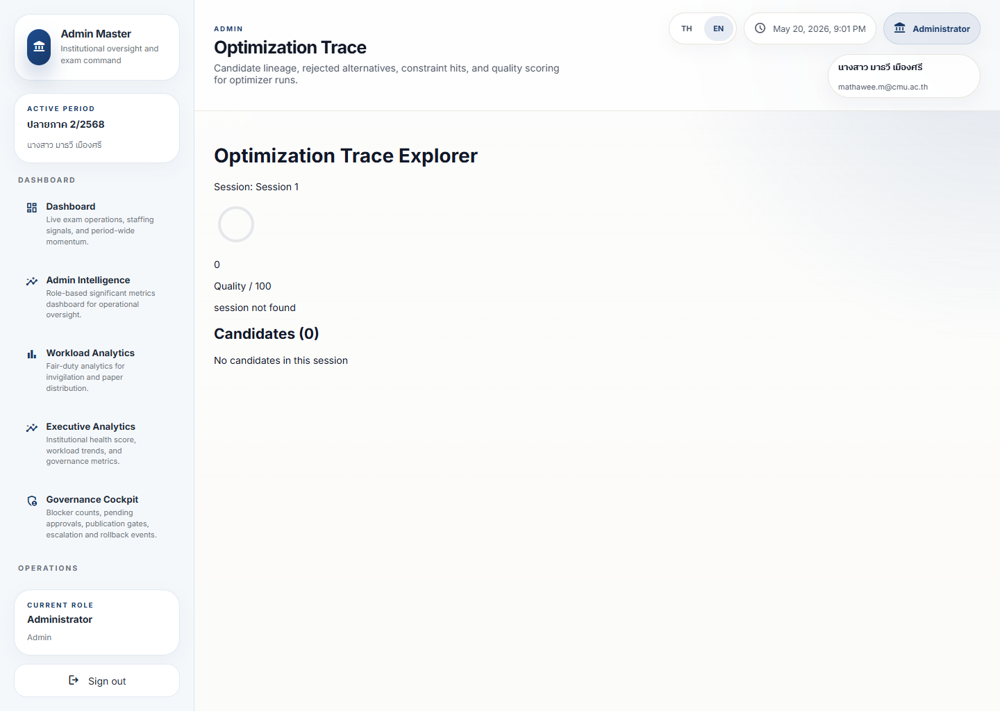

# Optimization Workflow Journey

## Operational Purpose

This journey shows how a user reviews or publishes an optimized plan after the system generates it.

## Expected Mindset

The user should verify safety before trusting the result.

## Step-by-Step Flow

1. Open the optimization dashboard.
2. Review quality, constraint, and balance signals.
3. Open the trace if the result looks unclear.
4. Compare the proposed plan against the real operational need.
5. Approve, revise, or reject the result.
6. Escalate if the plan is not safe to publish.

## Screenshot Sequence

### Screenshot 1: optimization dashboard

Look here first:
Pre-optimization setup, the run controls, and the assignment-results section.

Common mistake:
Running the optimizer before confirming the term, semester, and exam-type context.

What to do next:
Launch or refresh the optimizer only after the setup is trustworthy.

### Screenshot 2: optimization trace

Look here first:
The session label, quality score area, and candidate count.

Common mistake:
Assuming an empty trace means the optimizer succeeded cleanly.

What to do next:
Review whether the chosen session has usable candidate lineage before publishing.

## Annotation Instructions

- Highlight the quality score
- Circle the constraint warning
- Label the decision control
- Mark the publish or reject state

## Governance Implications

Optimization changes must not bypass policy, fairness, or readiness concerns.

## Stress Points

- Low-quality result
- Constraint failure
- Conflicting trace evidence
- Pressure to publish too early

## Common Errors

- Trusting the result without reviewing the trace
- Confusing a candidate with a final plan
- Ignoring a warning because the layout looks neat

## Recovery Path

- Check the quality and constraints again
- Review the trace
- Escalate if the plan needs correction before publication
