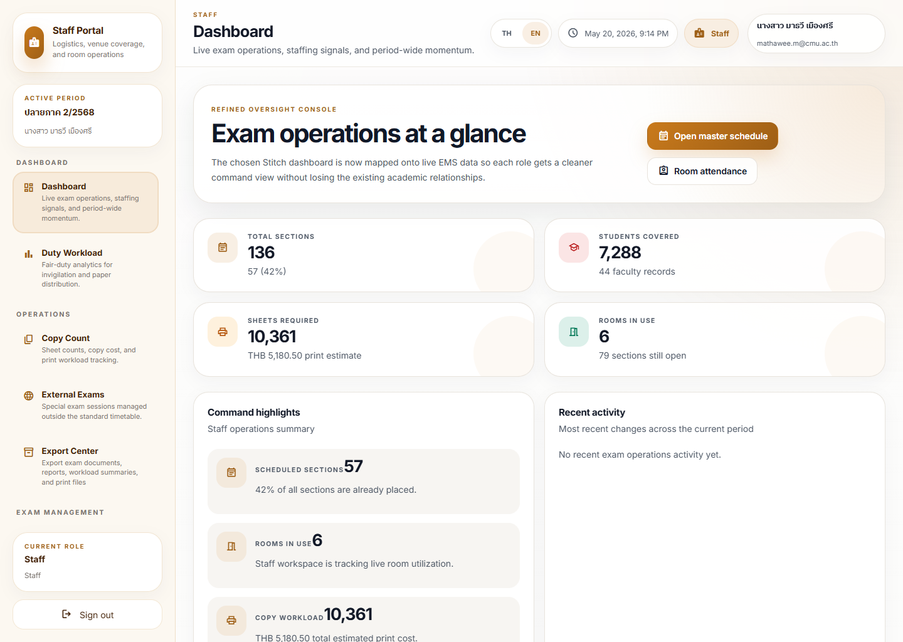
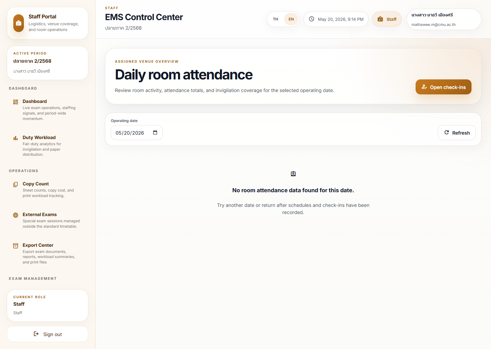
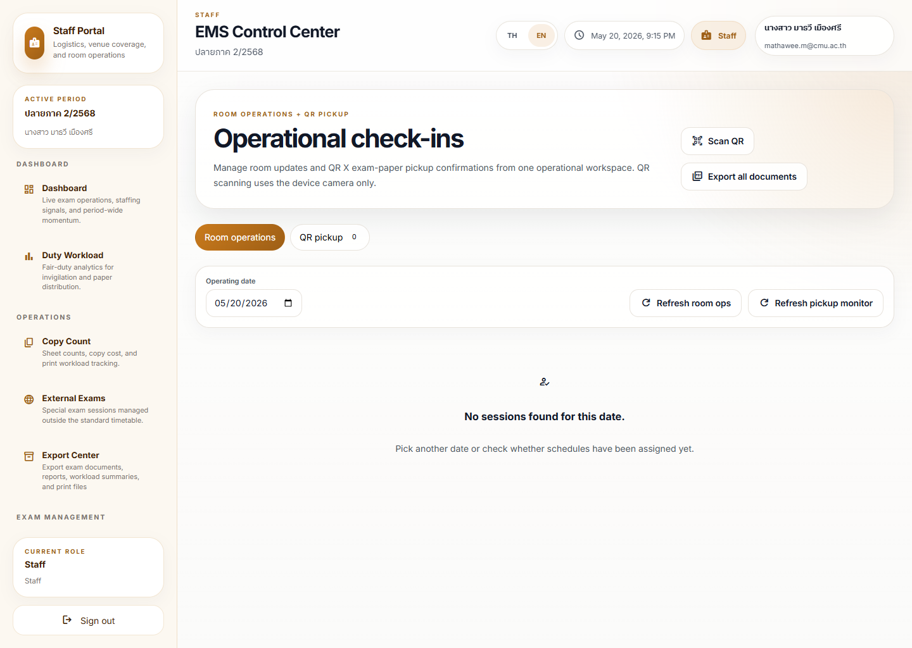

# Staff Room Operation Journey

## Operational Purpose

This journey shows how staff prepare and manage a room operation from setup to completion.

## Expected Mindset

The staff member should think in sequence: check, confirm, operate, close.

## Step-by-Step Flow

1. Open the room or schedule view.
2. Confirm the correct room and session.
3. Check materials, staffing, and readiness.
4. Start the room operation.
5. Monitor attendance and status during the session.
6. Update the record if something changes.
7. Escalate if the room becomes unsafe or inconsistent.

## Screenshot Sequence

### Screenshot 1: staff dashboard

Look here first:
The `Room attendance` action and the command highlights panel.

Common mistake:
Jumping straight into room action without checking whether the dashboard is already signaling a broader staffing or venue issue.

What to do next:
Open the room-attendance view.

### Screenshot 2: room attendance

Look here first:
The operating-date field, the `Open check-ins` action, and the current empty-state or room list.

Common mistake:
Treating a no-data result as proof the room is inactive, when it may only mean the date has no recorded check-ins yet.

What to do next:
Open `Check-ins` for the live attendance flow.

### Screenshot 3: check-ins

Look here first:
The live check-in surface and the first actionable record or empty-state guidance.

Common mistake:
Assuming room operations are complete before the live check-in state matches reality.

What to do next:
Update the room operation or escalate if the live state and the real room state diverge.

## Annotation Instructions

- Highlight the room name and session time
- Mark the readiness state
- Label staff coverage and attendance signals
- Circle any escalation or issue indicator

## Governance Implications

Room state should always match reality.

If the room changes, the record should change too.

## Stress Points

- Late staff arrival
- Room conflict
- Missing materials
- Attendance mismatch

## Common Errors

- Starting before readiness is confirmed
- Forgetting to update the room state
- Treating a room conflict as minor when it blocks operation

## Recovery Path

- Re-check the schedule and room assignment
- Confirm the current live status
- Escalate if the room cannot safely continue
