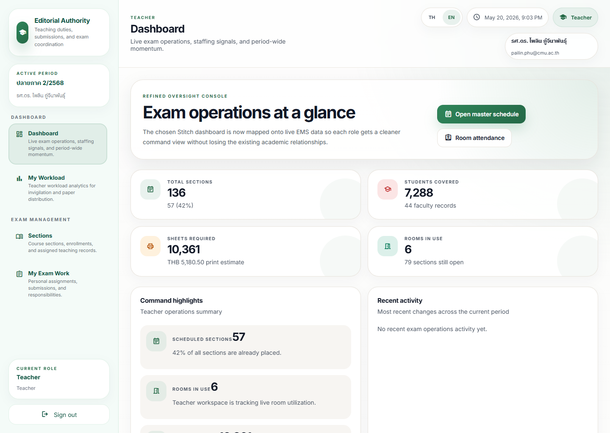
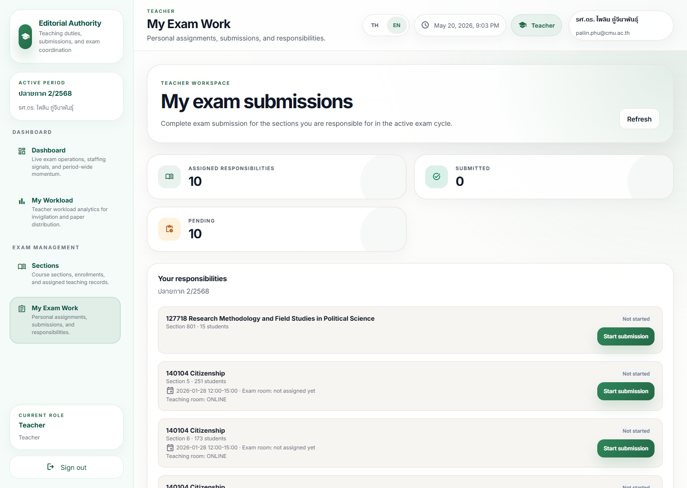
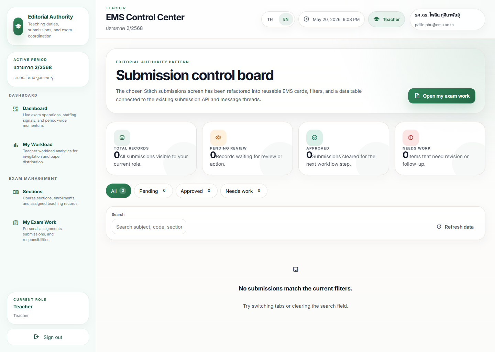

# Teacher Exam Submission Journey

## Operational Purpose

This journey shows how a teacher moves from assignment awareness to exam submission.

## Expected Mindset

The teacher should feel guided, not audited.

The workflow should feel like a clear checklist with visible progress.

## Step-by-Step Flow

1. Open the teacher-facing dashboard or work page.
2. Review the assigned exam and its deadline.
3. Open the submission screen.
4. Check the required details before uploading or confirming.
5. Submit the work.
6. Confirm that the status changed to complete.
7. Escalate if the status does not update or if the assignment looks wrong.

## Screenshot Sequence

### Screenshot 1: teacher dashboard

Look here first:
The hero action and the first task block that points the teacher toward the next responsibility.

Common mistake:
Treating the dashboard as a report page instead of a launch point into the actual exam work record.

What to do next:
Open `My Exam Work`.

### Screenshot 2: teacher exam work

Look here first:
Assigned responsibilities, pending count, and the first `Start submission` button.

Common mistake:
Opening the wrong section when multiple cards share a similar course title.

What to do next:
Open the exact responsibility record that matches the active deadline.

### Screenshot 3: teacher submissions

Look here first:
The status counters, the submission-state tabs, and the empty-state or result list.

Common mistake:
Assuming nothing was submitted just because the list is empty under the current tab or search filter.

What to do next:
Refresh the data, change the tab if needed, and confirm the visible status before escalating.

## Annotation Instructions

- Highlight the deadline and assignment name
- Circle the submit action
- Label the status indicator
- Mark any warning message in a visible callout

## Governance Implications

Teacher submissions create evidence for the workflow path.

Accurate submission and visible completion matter for audit, readiness, and downstream scheduling.

## Stress Points

- Missing deadline
- Wrong assignment
- Upload failure
- Unclear submission state

## Common Errors

- Believing the file was submitted when the status did not update
- Missing a warning message
- Opening the wrong exam record

## Recovery Path

- Refresh the page and check the status
- Review the assignment details again
- Contact the operational owner if the record still looks wrong
- Escalate if the issue blocks a required deadline
