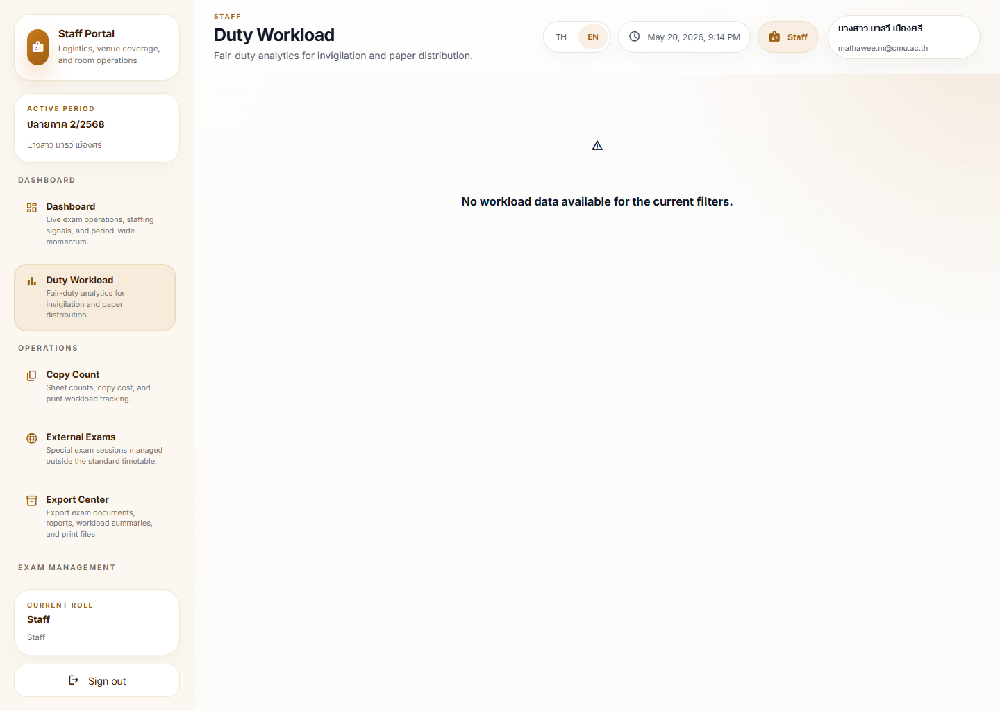
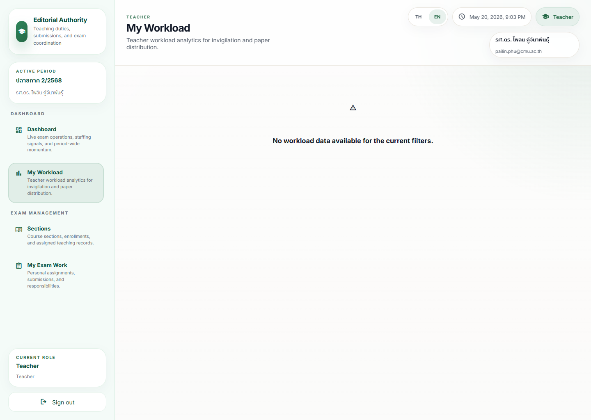

# Workload Balancing Journey

## Operational Purpose

This journey shows how a user reviews duty imbalance and decides whether assignments should be adjusted.

## Expected Mindset

The user should look for fairness, not just totals.

## Step-by-Step Flow

1. Open the workload analytics view.
2. Review the imbalance or fairness signal.
3. Check which people are carrying the most or least load.
4. Review the time-slot or daily pressure pattern.
5. Decide whether reassignment is needed.
6. Escalate if the imbalance affects fairness or readiness.

## Screenshot Sequence

### Screenshot 1: admin workload analytics

Look here first:
The current empty-state message for the admin workload scope.

Common mistake:
Treating a valid empty state as a broken route and skipping the filter or data check.

What to do next:
Confirm the route is correct, then review the staff or teacher variants if a narrower scope is needed.

### Screenshot 2: staff duty workload

Look here first:
The staff-role variant and whether the current filter set returns real rows or a no-data warning.

Common mistake:
Assuming the staff view should look identical to the admin view.

What to do next:
Escalate only if repeated empty states conflict with known assignment records.

### Screenshot 3: teacher workload

Look here first:
Teacher-facing summary cards and the personal workload context.

Common mistake:
Comparing the teacher view directly to institution-wide fairness without switching to an admin or staff scope first.

What to do next:
Use the correct role scope for fairness decisions.

## Annotation Instructions

- Highlight the fairness score
- Circle the heaviest and lightest loads
- Mark the pressure peak
- Label any imbalance warning

## Governance Implications

Workload balance affects fairness, staffing confidence, and trust in assignment decisions.

## Stress Points

- One person carrying too much load
- Missing assignment data
- Deadline pressure
- Conflicting fairness expectations

## Common Errors

- Looking only at totals
- Treating a high count as automatically bad
- Ignoring time-based concentration

## Recovery Path

- Re-check the scope and filters
- Compare against the expected assignment rules
- Escalate if the imbalance needs governance review
